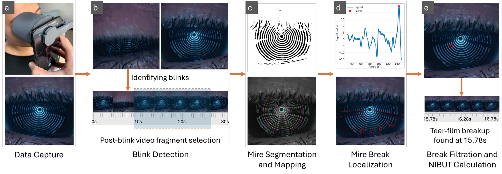

# DEDector: Smartphone-Based Noninvasive Screening of Dry Eye Disease

V.Ganatra, S. Gun, P.Joshi, A. Balasubramaniam, K. Murali, N. Kwatra and M. Jain. In: ACM IMWUT 2024 <br/>
[Paper](https://dl.acm.org/doi/10.1145/3699742)

### Abstract
Dry Eye Disease (DED) is an eye condition characterized by abnormalities in tear film stability. Despite its high prevalence, screening for DED remains challenging, primarily due to the invasive nature of most diagnostic tests. The Fluorescein Break-Up Time (FBUT) test, which involves instilling fluorescein dye in the eye, is a widely used method for assessing tear film stability. In this work, we propose DEDector, a low-cost, smartphone-based automated Non-Invasive Break-Up Time (NIBUT) measurement for DED screening. Utilizing a 3D-printed Placido ring attachment on a smartphone's camera, DEDector projects concentric rings onto the cornea, capturing a video for subsequent analysis using our proposed video processing pipeline to identify tear film stability. We conducted a real-world evaluation on 46 eyes, comparing DEDector with the traditional FBUT method. DEDector achieved a sensitivity of 77.78\% and specificity of 82.14\%, outperforming FBUT.


In this repository, we provide the code for the DEDector video-processing pipeline. The input to the pipeline is a mire video recorded using the [SmartKC](https://github.com/microsoft/SmartKC-A-Smartphone-based-Corneal-Topographer) hardware. The output from the pipeline is the Non-Invasive Break-Up Time (NIBUT). Here, we describe the details of the steps of the video-processing pipeline.

<p align='center'>
      
</p>

### Dependencies:
The dependencies required for this project are specified in the `requirements.txt` file. These can be installed using `pip` or `conda`, using the command:

`pip install -r requirements.txt`

Adjust the installations of `torch`, `torchvision` and `torchaudio` as per your cuda versions from the official [PyTorch installation website](https://pytorch.org/) 

### Running the pipeline:
There are two options to run the end-to-end pipeline: 

1. Running for a single video:
```
python ./video_processor.py --video <path to video> --out_dir <path to output directory>
```
2. Running for multiple videos in a directory:
```
python ./video_processor.py --video_dir <path to video directory> --out_dir <path to output directory>
```

The pipeline provides a comprehensive output for individual frames, including the cropped frames, signals used for identifying mire breaks and the candidate mire breaks. The final output is provided in the `nibut.json` file, which provides the blink and tear breakup times and the NIBUT. 

### About the code:
The pipeline follows these steps in calculating the NIBUT:
1. Find `blink` timestamp.
2. Process individual frames and extract mire locations and intensities
3. Calculate video sharpness from the extracted frames.
4. Adjust break thresholds using the calculated sharpness. Find candidate breaks in each frame.
5. Filter breaks.
6. Calculate NIBUT.

The code consists of two major classes: `VideoProcessor` and `FrameProcessor` to accomplish its goal. 

<b>class VideoProcessor:</b> class to process a video end-to-end
It consists of the following member functions:
```
def process_video(self, video_path: str, out_dir: str):

def detect_blinks(self, frames: List[np.array], out_dir: str, fps: float):

def calculate_video_sharpness(self, start_frame: float, end_frame: float, in_dir: float):

def calculate_nibut(self, filtered_breaks: pd.DataFrame, in_dir: str, mean_sharpness: str):

def check_temporal_validity(self, mire: float, angle: float, frame: float, in_dir: str, sharpness: float):

def filter_breaks(self, data: pd.DataFrame):

def collate_breaks(self, frame_to_process: List[int], out_dir: str):

def plot_signal(self, x: List, y: List, xlabel: str, ylabel: str, title: str, label: str, out_dir: str, scatter_plot: bool = False, save: bool = False):
```


<b> class FrameProcessor:</b> class to process a frame
It consists of the following member functions:
```
def preprocess_frame(self, frame: np.array, out_dir: str, crop_dims: List = [500,500]):

def extract_mire_intensities(self, frame: np.array, out_dir: str):

def find_signal(self, mire_intensities: dict, threshold_perc: float):

def find_supports(self, mire_signals: dict, out_dir: str):

def find_peaks(self, mire_signals: dict, left_support: float, right_support: float, out_dir: str, frame_num: float, mire_locations: dict):

def find_breaks(self, frame: np.array, mire_intensities: dict, mire_locations: dict, center: List, out_dir: str, frame_num: float, threshold_perc: float):
```

Besides these two classes, the pipeline uses `graph_cluster` based `mire_localization` from the [SmartKC repo](https://github.com/microsoft/SmartKC-A-Smartphone-based-Corneal-Topographer)

### Citation
If you are using this code for your work, please cite:
```
@article{10.1145/3699742,
author = {Ganatra, Vaibhav and Gun, Soumyasis and Joshi, Pallavi and Balasubramaniam, Anand and Murali, Kaushik and Kwatra, Nipun and Jain, Mohit},
title = {DEDector: Smartphone-Based Noninvasive Screening of Dry Eye Disease},
year = {2024},
issue_date = {December 2024},
publisher = {Association for Computing Machinery},
address = {New York, NY, USA},
volume = {8},
number = {4},
url = {https://doi.org/10.1145/3699742},
doi = {10.1145/3699742},
journal = {Proc. ACM Interact. Mob. Wearable Ubiquitous Technol.},
month = nov,
articleno = {190},
numpages = {26},
keywords = {Diagnosis, Evaluation, Medical, NIBUT, Non-invasive, TBUT, Tear Break-up Time}
}
```

### Acknowledgements
Our repository references code from the following repos:
1. [SmartKC](https://github.com/microsoft/SmartKC-A-Smartphone-based-Corneal-Topographer)
2. [U-Net](https://github.com/jvanvugt/pytorch-unet)
