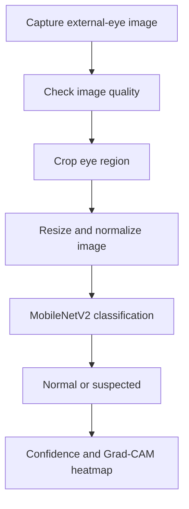

# Pterygium Module — Notion requirements snapshot

Retrieved 2026-09-14 from https://app.notion.com/p/3cbc16ecc9ae80fd8d8ceb713104598e?pvs=204

This is the source page as fetched; claims below are requirements/background, not verified results of this implementation. An embedded bookmark was not exposed by the connector.

Here is the result of "fetch" for the Page with URL https://app.notion.com/p/3cbc16ecc9ae80fd8d8ceb713104598e as of 2026-08-29T16:37:17.161Z:
<page url="https://app.notion.com/p/3cbc16ecc9ae80fd8d8ceb713104598e">
<ancestor-path></ancestor-path>
<properties>
{"title":"Pterygium Module"}
</properties>
<iconMetadata>null</iconMetadata>
<content>
Build a smartphone-based screening module that:
1. Captures a normal close-up photograph of the eye.
2. Checks whether the image quality is acceptable.
3. Analyses the visible tissue growth near the cornea.
4. Produces:
	- `Normal`
	- `Suspected Pterygium`
	- Confidence score
	- Heatmap showing the region considered by the model
5. Recommends an ophthalmologist examination when pterygium is suspected.
It will be a screening tool—not a confirmed medical diagnosis.
---
### Pterygium is suitable because:
- The tissue growth is externally visible.
- A normal smartphone photograph can capture it.
- No Placido attachment is required.
- It is genuinely different from keratoconus and dry eye.
- MobileNetV2 is lightweight enough for mobile or low-cost backend deployment.
- It gives the project a proper image-classification AI module.
Important: Pterygium starts from the conjunctiva and may grow towards the cornea. Therefore, describe the complete project as:
> Smartphone-based screening for corneal and ocular-surface conditions.
Do not call all three “corneal diseases.”
---
### Workflow of the Pterygium

---
### Dataset availability in the paper
<unknown url="https://app.notion.com/p/3cbc16ecc9ae80fd8d8ceb713104598e#3cbc16ecc9ae80af92b8ef7532b95d58" alt="bookmark"/>
The paper used **1,220 eye images**, but the dataset is **not publicly downloadable**.
<table header-row="true">
<tr>
<td>Class</td>
<td>Total</td>
<td>Training</td>
<td>Validation</td>
<td>Testing</td>
</tr>
<tr>
<td>Normal</td>
<td>439</td>
<td>225</td>
<td>25</td>
<td>189</td>
</tr>
<tr>
<td>Observation-stage pterygium</td>
<td>421</td>
<td>225</td>
<td>25</td>
<td>171</td>
</tr>
<tr>
<td>Surgery-stage pterygium</td>
<td>360</td>
<td>225</td>
<td>25</td>
<td>110</td>
</tr>
<tr>
<td>**Total**</td>
<td>**1,220**</td>
<td>**675**</td>
<td>**75**</td>
<td>**470**</td>
</tr>
</table>
The training images were augmented using horizontal flipping and rotations of −3° and +3°, increasing the training set from **675 to 4,050 images**.
Other details:
- Image resolution: **5184 × 3456 pixels**
- Source: Eye Hospital of Nanjing Medical University
- Images were captured using the same environment and equipment
- Patient-identifying information was removed
- Observation stage: tissue invasion **below 3 mm**
- Surgery stage: tissue invasion **3 mm or greater**
These details are provided in the [full published paper](https://www.sciopen.com/local/article_pdf/10.18240/ijo.2024.07.02.pdf?utm_source=chatgpt.com).
### Can we download it?
No public download link, GitHub repository, model weights or dataset availability statement is provided in the paper. Therefore, it appears to be a **private hospital dataset**.
The paper lists these corresponding-author contacts for requesting research access:
- `wtongxxiwq125@126.com`
- `hypotato@126.com`
The paper also mentions **UBIRIS, MILES, Brazilian Pterygium and Australian Pterygium datasets**, but only as datasets used in previous research—not as the dataset used to train this model.
---
### Email we should send
**Subject:** Request for Pterygium Image Dataset for Academic Research
> Dear Dr. Xi and Dr. Zhang,
	I am a Computer Science student from Kumaraguru College of Technology, India. We are developing a non-commercial academic prototype for smartphone-based pterygium screening.
	We studied your paper, “Intelligent diagnostic model for pterygium by combining attention mechanism and MobileNetV2.”
	We would like to request research access to the de-identified pterygium image dataset used in your study. If possible, we would also appreciate the class labels, train/validation/test split, preprocessing details, source code and trained model weights.
	The dataset will be used only for academic research. We are willing to follow the required licence, citation, ethics and Data Use Agreement conditions.
	Please let us know the procedure for requesting access.
	Regards,
	Kaushiik
	Kumaraguru College of Technology
	India
---
### Dataset comparison
<table header-row="true">
<tr>
<td>Dataset</td>
<td>Images relevant to us</td>
<td>Availability</td>
<td>Suitability</td>
</tr>
<tr>
<td>**SLID**</td>
<td>163 images containing pterygium; 245 normal images</td>
<td>Public GitHub download</td>
<td>**Best dataset to start now**</td>
</tr>
<tr>
<td>Smartphone Fusion Dataset</td>
<td>1,094 smartphone + 20,987 slit-lamp images</td>
<td>Available on author request</td>
<td>**Best match for our final smartphone system**</td>
</tr>
<tr>
<td>SEED/Handheld Dataset</td>
<td>2,503 development + 629 validation + 6,311 external images</td>
<td>Available on author request</td>
<td>Excellent, with public training code</td>
</tr>
<tr>
<td>Mendeley Eye Disease Dataset</td>
<td>Only 17 original pterygium images; 102 after augmentation</td>
<td>Public, CC BY 4.0</td>
<td>Too small; supplemental testing only</td>
</tr>
<tr>
<td>Conjunctival Image Dataset</td>
<td>Approximately 75 pterygium images</td>
<td>Public, CC BY-NC 3.0</td>
<td>Experimental use only; collected from web searches</td>
</tr>
<tr>
<td>Australian/Brazilian Pterygium</td>
<td>Pterygium photographs</td>
<td>No working public download found</td>
<td>Would require contacting original researchers</td>
</tr>
<tr>
<td>UBIRIS/MILES</td>
<td>Normal eye images</td>
<td>Public/research access</td>
<td>Only normal controls—not pterygium datasets</td>
</tr>
</table>
#### 1. SLID: recommended starting dataset {toggle="true"}
	[Download SLID from GitHub](https://github.com/xumingyu-hub/SLID?utm_source=chatgpt.com)
	It contains:
	- 2,617 slit-lamp eye images
	- 163 images carrying a pterygium label
	- 92 images showing only pterygium
	- 245 normal images
	- Other conditions such as pinguecula, tumours, conjunctival injection and cysts
	- Bounding-box annotations in `Annotations.csv`
	- Original images in `Original_Slit-lamp_Images.zip`
	- Different image resolutions
	The dataset is de-identified and was publicly released by Zhejiang University researchers. [SLID dataset paper](https://www.frontiersin.org/journals/digital-health/articles/10.3389/fdgth.2025.1716501/full?utm_source=chatgpt.com)
	This dataset is useful because the other diseases can act as difficult negative examples. For example, the model must learn not to mistake pinguecula or eye redness for pterygium.
	One issue: the GitHub repository does not currently show a separate dataset licence file. We can use it for academic research with citation, but we should email the authors for licence confirmation before redistribution.
#### 2. Smartphone Fusion Dataset: best dataset if approved {toggle="true"}
	This study used:
	- 20,987 slit-lamp images
	- 1,094 smartphone images
	- Different smartphone brands
	- Pterygium detection, segmentation and grading labels
	The authors state that data are available on reasonable request. [Published smartphone study](https://pmc.ncbi.nlm.nih.gov/articles/PMC10894821/?utm_source=chatgpt.com)
	Contact:
	- Professor Zuguo Liu
	- `zuguoliu@xmu.edu.cn`
	This should be our highest-priority request because its smartphone images closely match our final application.
#### 3. SEED and handheld-camera dataset {toggle="true"}
	This study used:
	- 2,503 development images
	- 629 internal validation images
	- 2,610 external slit-lamp images
	- 3,701 external handheld-camera images
	The paper states that the data can be requested from the corresponding author. [Published paper](https://bjo.bmj.com/content/106/12/1642?utm_source=chatgpt.com)
	Contact:
	- Dr Yih-Chung Tham
	- `tham.yih.chung@seri.com`
	The researchers have also released their [pterygium training and Grad-CAM code](https://github.com/SERI-EPI-DS/pterygium_detection?utm_source=chatgpt.com), but the images and trained weights are not included.
#### 4. Mendeley Eye Disease Dataset {toggle="true"}
	[Download from Mendeley Data](https://data.mendeley.com/datasets/s9bfhswzjb/1?utm_source=chatgpt.com)
	It is publicly available under CC BY 4.0, but it has only:
	- 17 original pterygium images
	- 102 images after augmentation
	The augmented images are transformed copies, not 102 different patients. Therefore, this dataset is too small to be our main dataset.
---
### Pterygium dataset summary
We have three possible datasets:
<table header-row="true">
<colgroup>
<col width="235.66666666666666">
<col width="235.66666666666666">
<col width="235.66666666666666">
</colgroup>
<tr>
<td>Dataset</td>
<td>Availability</td>
<td>Purpose</td>
</tr>
<tr>
<td>**SLID**</td>
<td>Publicly downloadable</td>
<td>Use immediately for the initial binary model: No pterygium / Suspected pterygium</td>
</tr>
<tr>
<td>**Smartphone Fusion Dataset**</td>
<td>Author approval required</td>
<td>Best for training and validating the final smartphone-based system</td>
</tr>
<tr>
<td>**SEED Dataset**</td>
<td>Author approval required</td>
<td>Supports No pterygium / Non-referable / Referable pterygium classification</td>
</tr>
</table>
### Plan
1. Start initial development using **SLID**.
2. Request the Smartphone Fusion Dataset from `zuguoliu@xmu.edu.cn`.
3. Request the SEED Dataset from `tham.yih.chung@seri.com`.
4. If either request is approved, use those images to improve and validate the smartphone model.
---
### SLID Initial Pterygium Module Approach
The correct dataset name is **SLID**. It will be used to build our first working pterygium screening model.
#### 1. Initial goal {toggle="true"}
	Input:
	- One close-up external-eye photograph
	Output:
	- **No visible pterygium pattern**
	- **Suspected pterygium**
	This first version will not grade severity or confirm a diagnosis.
#### 2. Dataset details {toggle="true"}
	Download: [Official SLID GitHub repository](https://github.com/xumingyu-hub/SLID?utm_source=chatgpt.com)
	<table header-row="true">
<tr>
<td>Detail</td>
<td>Value</td>
</tr>
<tr>
<td>Complete dataset</td>
<td>2,617 images</td>
</tr>
<tr>
<td>Patients</td>
<td>1,119</td>
</tr>
<tr>
<td>Images containing pterygium</td>
<td>163</td>
</tr>
<tr>
<td>Pterygium-only images</td>
<td>92</td>
</tr>
<tr>
<td>Normal images</td>
<td>245</td>
</tr>
<tr>
<td>Image format</td>
<td>PNG</td>
</tr>
<tr>
<td>Annotation file</td>
<td>`Annotations.csv`</td>
</tr>
	</table>
	The images were captured using slit-lamp cameras and annotated by ophthalmologists. [SLID paper](https://www.frontiersin.org/journals/digital-health/articles/10.3389/fdgth.2025.1716501/full?utm_source=chatgpt.com)
#### 3. Files required {toggle="true"}
	```plain text
SLID/
├── Original_Slit-lamp_Images.zip
└── Annotations.csv
	```
	After extraction:
	```plain text
SLID/
├── images/
│   ├── 1.png
│   ├── 2.png
│   └── ...
└── Annotations.csv
	```
	`Annotations.csv` provides:
	- Image filename
	- Anatomical region
	- Disease label
	- Annotation type
	- Lesion coordinates
#### 4. Create our initial dataset {toggle="true"}
	We will convert the original annotations into one label for every image.
	<table header-row="true">
<tr>
<td>Condition</td>
<td>Our label</td>
</tr>
<tr>
<td>Image contains `pterygium`</td>
<td>`1 — Suspected pterygium`</td>
</tr>
<tr>
<td>Image is marked normal</td>
<td>`0 — No visible pterygium`</td>
</tr>
	</table>
	Initial dataset:
	- 163 pterygium-positive images
	- 245 normal images
	- **408 images total**
	Images containing other diseases will not be used in the first experiment.
#### 5. Data checking {toggle="true"}
	Before training, verify:
	- Every CSV filename has a corresponding image.
	- No image is corrupted.
	- Labels are correctly extracted.
	- Duplicate and near-duplicate images are identified.
	- The black patient-information area is excluded from the model’s focus.
	- Pterygium bounding boxes match the correct lesion.
	SLID may contain multiple photographs from the same patient. Since the public CSV does not clearly provide patient IDs, we must group near-duplicate images using perceptual hashing before splitting. This reduces the chance of nearly identical images entering both training and testing.
#### 6. Image preprocessing {toggle="true"}
	For every image:
	1. Read the PNG image.
	2. Crop the useful eye region.
	3. Remove unnecessary borders and black information area.
	4. Resize the image to **224 × 224 pixels**.
	5. Convert it to RGB.
	6. Apply MobileNetV2 ImageNet normalization.
	Training-only augmentation:
	- Horizontal flip
	- Rotation between approximately −10° and +10°
	- Small zoom
	- Slight brightness and contrast adjustment
	- Small position shift
	Do not use:
	- Vertical flipping
	- Strong colour changes
	- Large rotations
	- Heavy stretching or distortion
	These can create medically unrealistic images.
#### 7. Dataset split {toggle="true"}
	Use a stratified split:
	<table header-row="true">
<tr>
<td>Dataset</td>
<td>Percentage</td>
<td>Purpose</td>
</tr>
<tr>
<td>Training</td>
<td>70%</td>
<td>Teach the model</td>
</tr>
<tr>
<td>Validation</td>
<td>15%</td>
<td>Select model settings</td>
</tr>
<tr>
<td>Testing</td>
<td>15%</td>
<td>Final evaluation</td>
</tr>
	</table>
	Duplicate or visually similar images must remain in the same split.
	Augmentation must be applied only to the training set.
#### 8. AI model {toggle="true"}
	Use **MobileNetV2 with transfer learning**.
	Transfer learning means we start with a model already trained to understand common visual features instead of training everything from zero.
	Model structure:
	```plain text
Eye image
    ↓
MobileNetV2 pretrained model
    ↓
Global average pooling
    ↓
Dropout
    ↓
Binary classification layer
    ↓
Normal or Suspected pterygium
	```
#### 9. Training process {toggle="true"}
	#### First training stage
	- Load ImageNet-pretrained MobileNetV2.
	- Freeze the MobileNetV2 layers.
	- Train only the new classification layer.
	- Train for approximately 5–10 epochs.
	#### Fine-tuning stage
	- Unfreeze the final MobileNetV2 layers.
	- Use a smaller learning rate.
	- Train for approximately another 10–20 epochs.
	- Stop early if validation performance stops improving.
	Use class weights because the number of normal and pterygium images is different.
#### 10. Technologies {toggle="true"}
	<table header-row="true">
<tr>
<td>Requirement</td>
<td>Technology</td>
</tr>
<tr>
<td>Programming</td>
<td>Python</td>
</tr>
<tr>
<td>AI framework</td>
<td>TensorFlow/Keras</td>
</tr>
<tr>
<td>Image processing</td>
<td>OpenCV</td>
</tr>
<tr>
<td>Dataset processing</td>
<td>Pandas</td>
</tr>
<tr>
<td>Dataset splitting and metrics</td>
<td>Scikit-learn</td>
</tr>
<tr>
<td>Graphs</td>
<td>Matplotlib/Seaborn</td>
</tr>
<tr>
<td>Mobile model</td>
<td>TensorFlow Lite</td>
</tr>
<tr>
<td>Explanation heatmap</td>
<td>Grad-CAM</td>
</tr>
	</table>
#### 11. Model evaluation {toggle="true"}
	We will calculate:
	- Sensitivity: how many pterygium images were detected
	- Specificity: how many normal images were correctly rejected
	- Precision
	- F1-score
	- ROC-AUC
	- Confusion matrix
	Accuracy alone should not be used because a medical-screening model must also minimise missed cases.
#### 12. Grad-CAM verification {toggle="true"}
	Grad-CAM produces a heatmap showing which eye area influenced the result.
	We must confirm that the model focuses on:
	- The conjunctiva
	- Corneal boundary
	- Visible pterygium growth
	It must not focus mainly on:
	- Black information boxes
	- Image borders
	- Text
	- Camera artefacts
	- Background
	If it focuses on these incorrect areas, the model must be retrained.
#### 13. Initial software test {toggle="true"}
	Before Android integration, create a simple Python test interface:
	1. Upload an eye photograph.
	2. Check image quality.
	3. Run MobileNetV2.
	4. Display the result.
	5. Display the confidence score.
	6. Display the Grad-CAM heatmap.
	Result wording:
	- `No visible pterygium pattern`
	- `Suspected pterygium — professional eye examination recommended`
	- `Image quality insufficient — retake photograph`
#### 14. Android integration {toggle="true"}
	After the Python model works:
	1. Convert the trained model to `.tflite`.
	2. Add the model to the Android application.
	3. Capture a normal external-eye photograph.
	4. Do not use the SmartKC Placido attachment for this test.
	5. Resize and normalise the photograph.
	6. Run the model.
	7. Display the screening result.
	The application should check:
	- Eye is centred
	- Image is sharp
	- Lighting is uniform
	- Complete cornea and eye white are visible
	- No strong reflection or shadow
#### 15. Important limitation {toggle="true"}
	SLID contains **slit-lamp photographs**, while our final system uses smartphone photographs. Therefore:
	- SLID is sufficient for developing and testing the initial pipeline.
	- SLID performance does not prove smartphone accuracy.
	- Smartphone data will be required for fine-tuning and final validation.
#### 16. Next development stage {toggle="true"}
	If the requested datasets are approved:
	- Use the Smartphone Fusion dataset to fine-tune the model for phone images.
	- Use SEED labels to support:
		- No pterygium
		- Non-referable pterygium
		- Referable pterygium
	- Validate using photographs from different smartphone models.
#### 17. Initial deliverables {toggle="true"}
	The SLID phase should produce:
	- Downloaded and verified dataset
	- Clean image-label CSV
	- Train/validation/test split
	- Preprocessing code
	- MobileNetV2 training code
	- Evaluation report
	- Confusion matrix and ROC curve
	- Grad-CAM images
	- Saved TensorFlow model
	- Converted `.tflite` model
	- Simple image-upload test interface
	The end result of this stage is a **working binary pterygium screening proof of concept**, ready for later smartphone fine-tuning and validation.
</content>
</page>
